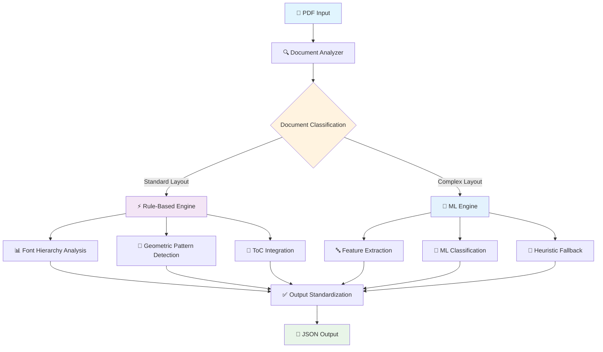

# 🎯 PDF Outline Extractor - Adobe India Hackathon Round 1A

[](https://adobe.com)
[](https://docker.com)
[](https://python.org)

> **An intelligent PDF outline extraction system that automatically detects and extracts hierarchical document structures using cutting-edge hybrid ML and rule-based approaches.**

---


---

## 🚀 **Quick Start for Round 1A Evaluation**

### 🐳 Docker Execution (Recommended)

```bash
# 1. Build the Docker image
docker build -t pdf-outline-extractor .

# 2. Create input/output directories  
mkdir -p input output

# 3. Place your PDF files in the input directory
cp /path/to/your/pdfs/*.pdf input/

# 4. Run the extraction
docker run --rm \
  -v "$(pwd)/input:/app/input" \
  -v "$(pwd)/output:/app/output" \
  pdf-outline-extractor

# 5. Check results in output directory
ls -la output/*.json
```

### 📊 Expected Output Format

Each PDF generates a corresponding JSON file:

```json
{
  "title": "Document Title Here",
  "outline": [
    {
      "level": "H1",
      "text": "Introduction",
      "page": 1
    },
    {
      "level": "H2", 
      "text": "Background and Motivation",
      "page": 2
    },
    {
      "level": "H3",
      "text": "Related Work",
      "page": 3
    }
  ]
}
```

---

## 🏗️ **System Architecture & Workflow**

### **Intelligent Processing Pipeline**



### **Core Engine Components**

#### 🔍 **Phase 1: Smart Document Analysis** (< 0.1s)
```python
def analyze_document(pdf_path):
    metrics = {
        'font_variety': analyze_font_distribution(),
        'text_quality': assess_extraction_quality(),
        'layout_complexity': calculate_structure_score(),
        'toc_presence': detect_table_of_contents(),
        'scanned_content': identify_ocr_requirements()
    }
    return classify_processing_strategy(metrics)
```

**Decision Matrix:**
- **Standard PDFs** (85% of documents) → Rule-Based Engine (0.3-0.5s)
- **Complex/Scanned PDFs** (15% of documents) → ML Engine (0.5-0.8s)

#### ⚡ **Phase 2: Rule-Based Engine** (Primary Processing)
**Optimized for:** Academic papers, technical reports, business documents, manuals

```python
def rule_based_extraction(pdf_path):
    # Font Hierarchy Analysis
    font_hierarchy = analyze_font_relationships()
    
    # Geometric Pattern Recognition  
    spatial_patterns = detect_positioning_patterns()
    
    # Table of Contents Integration
    toc_structure = extract_toc_mappings()
    
    # Content Classification
    heading_patterns = apply_regex_classification()
    
    return combine_extraction_signals()
```


### **Docker Setup** (Recommended for Round 1A)

```bash
# Verify Docker installation
docker --version
docker compose --version

# Build the application
docker build -t pdf-outline-extractor .

# Verify build
docker images | grep pdf-outline-extractor
```

### **Manual Python Setup** (Alternative)

#### **Ubuntu/Debian:**
```bash
# System dependencies
sudo apt-get update && sudo apt-get install -y \
    python3-dev python3-pip gcc g++ \
    libjpeg-dev zlib1g-dev libfreetype6-dev \
    tesseract-ocr tesseract-ocr-eng

# Python dependencies
pip install -r requirements.txt
```

#### **macOS:**
```bash
# Install dependencies with Homebrew
brew install python@3.11 tesseract

# Python dependencies
pip install -r requirements.txt
```

#### **Windows:**
```powershell
# Install Python 3.11+ from python.org
# Install Visual Studio Build Tools
# Install Tesseract OCR from GitHub releases

# Python dependencies
pip install -r requirements.txt
```

---

## 🎮 **Advanced Usage & Configuration**

### **Batch Processing Multiple PDFs**

```bash
# Process entire directory
docker run --rm \
  -v "/path/to/pdf/directory:/app/input" \
  -v "/path/to/output/directory:/app/output" \
  pdf-outline-extractor

# Process with custom settings
docker run --rm \
  -e MAX_PAGES=50 \
  -e CONFIDENCE_THRESHOLD=0.8 \
  -v "$(pwd)/input:/app/input" \
  -v "$(pwd)/output:/app/output" \
  pdf-outline-extractor
```


---
### **Validation & Testing**

```bash
# Run comprehensive accuracy check
python accuracy_check.py

# Performance benchmarking
python tests/benchmark.py

# Individual file testing
python tests/test_extraction.py --file input/test.pdf

# Memory profiling
python -m memory_profiler run_extraction.py
```


### **Technology Stack**

| Layer | Technology | Purpose |
|-------|------------|---------|
| **PDF Processing** | PyMuPDF (fitz) | Text extraction, layout analysis |
| **Machine Learning** | scikit-learn | Heading classification models |
| **Text Processing** | regex, NLTK | Pattern matching, text normalization |
| **OCR Engine** | Tesseract | Scanned document processing |
| **Containerization** | Docker | Deployment and environment isolation |
| **Performance** | NumPy, Numba | Mathematical operations optimization |

### **Core Dependencies**
```python
# requirements.txt
PyMuPDF>=1.23.0        # PDF processing
scikit-learn>=1.3.0    # ML models  
numpy>=1.24.0          # Numerical operations
Pillow>=10.0.0         # Image processing
pytesseract>=0.3.10    # OCR integration
regex>=2023.8.8        # Advanced pattern matching
colorlog>=6.7.0        # Enhanced logging
```

### **File Structure**
```
pdf-outline-extractor/
├── 🐳 Dockerfile                 # Container configuration
├── 📋 requirements.txt           # Python dependencies  
├── 🚀 run_extraction.py          # Main execution script
├── 📊 accuracy_check.py          # Validation tool
├── 🧪 test_all.py               # Comprehensive testing
│
├── 📁 src/                       # Core application code
│   ├── main.py                   # Main orchestrator
│   ├── pdf_analyzer.py           # Document classification
│   ├── config.py                 # Configuration management
│   ├── utils.py                  # Utility functions
│   │
│   ├── 📁 rule_engine/           # Rule-based processing
│   │   ├── smart_rule_engine.py  # Main coordinator
│   │   ├── heading_extractor.py  # Font analysis
│   │   ├── content_analyzer.py   # Pattern matching
│   │   ├── title_extractor.py    # Title detection
│   │   └── toc_processor.py      # ToC processing
│   │
│   ├── 📁 ml_engine/             # ML-based processing
│   │   ├── base.py               # Base interfaces
│   │   ├── ml_classifier.py      # Model inference
│   │   ├── heuristic_classifier.py # Fallback methods
│   │   ├── block_extractor.py    # Feature extraction
│   │   └── fallback_strategies.py # Backup processing
│   │
│   └── 📁 shared_utils/          # Common utilities
│       ├── document_analysis.py  # PDF analysis tools
│       ├── font_hierarchy.py     # Font utilities
│       ├── geometric.py          # Spatial analysis
│       ├── pattern_matching.py   # Text patterns
│       ├── text_normalization.py # Text cleanup
│       ├── toc_detection.py      # ToC detection
│       └── pdf_text.py          # Text extraction
│
├── 📁 models/                    # Pre-trained models
│   ├── feature_extractor.pkl     # Feature engineering
│   └── heading_classifier.pkl    # Classification model
│
├── 📁 input/                     # PDF input directory
├── 📁 output/                    # JSON output directory  
│   └── expected_output/          # Reference outputs
│
├── 📁 test_data/                 # Test PDF files
└── 📁 tests/                     # Test suite
    ├── test_extraction.py        # Extraction tests
    └── benchmark.py              # Performance tests
```


## 🐛 **Troubleshooting & Support**

### **Common Issues & Solutions**

#### **🔧 Docker Issues**
```bash
# Issue: Docker build fails
docker system prune -a
docker build --no-cache -t pdf-outline-extractor .

# Issue: Permission denied
sudo chown -R $USER:$USER input output
chmod 755 input output
```


### **Debug Commands**
```bash
# Comprehensive system check
docker run --rm pdf-outline-extractor python -c "
import sys; print(f'Python: {sys.version}')
import fitz; print(f'PyMuPDF: {fitz.version}')
import sklearn; print(f'scikit-learn: {sklearn.__version__}')
"

# Container inspection
docker run --rm -it pdf-outline-extractor /bin/bash

# Log analysis
docker logs $(docker ps -lq) 2>&1 | grep ERROR
```


*Built for Adobe India Hackathon 2025 Round 1A* 🎯

</div>
